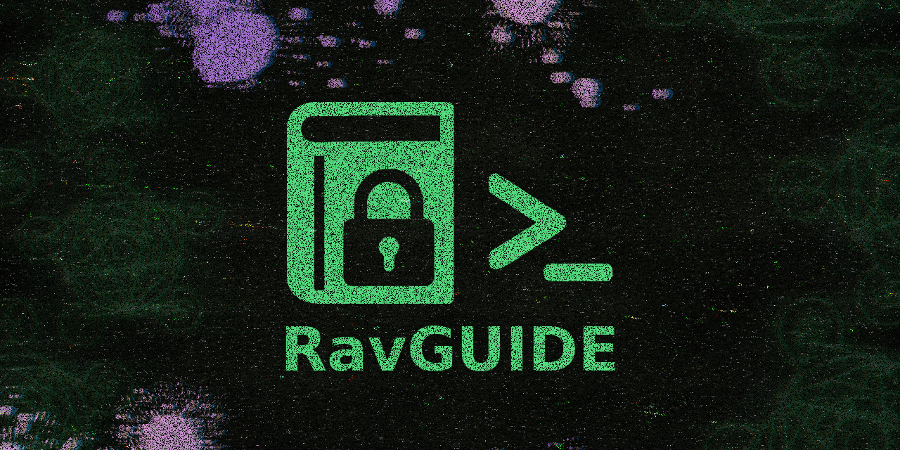
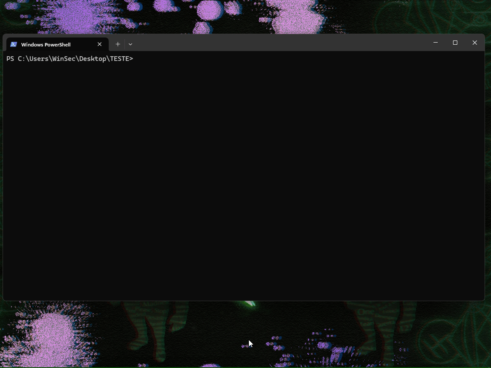

> [!WARNING]  
> Esse projeto aceita contribuições com muito carinho 💚, mas é essencial seguir algumas regras:  
> ```
> • 🚫 Não altere a lógica, o propósito ou a essência do projeto.  
> • 🗂️ Melhorias na estrutura de arquivos são bem-vindas, desde que não comprometam o funcionamento principal do projeto.  
> • 🎨 Contribuições no sistema de gerenciamento de cores (menus, opções, temas etc.) são permitidas e incentivadas!  
> • 📦 Os padrões visuais definidos com "boxen" e "chalk" devem ser mantidos nos quadros dos menus:  
>   • Bordas verdes  
>   • Fundo cinza escuro  
>   • Links em azul claro  
>   • Outros estilos previamente definidos  
>   As modificações ideais devem se restringir ao sistema de cores do menu interativo e afins. 
> ```
> > Todas as alterações que não seguirem as regras serão recusadas.

---


<div align="center">

<a href="https://www.npmjs.com/package/ravguide" target="_blank"></a>  
 <a href="https://www.npmjs.com/package/ravguide" target="_blank"></a>

---

# 🔒 SECGUIDE
### 📖 Guia de segurança digital modular e interativo via CLI/NPM

[](https://github.com/ravenastar-js/ravguide/stargazers)
[](https://github.com/ravenastar-js/ravguide/network/members)
[](https://www.npmjs.com/package/ravguide)
[](https://nodejs.org)
[](LICENSE)

*Biblioteca NPM + CLI*

</div>



<div align="center">
BANNER INSPIRADO EM
<br>
<a href="https://store.steampowered.com/app/1507580/Enigma_do_Medo" >
  
</a>
</div>

---

## 🎯 Visão Geral

O **SECGUIDE** é uma ferramenta de linha de comando (CLI) e NPM, que oferece guias rápidos e informações sobre segurança digital de forma organizada e acessível.

## ⚡ Como funciona?

### 🎮  MODO INTERATIVO:

```bash
    $ ravguide
    → Menu navegável com todas as categorias
```

### 🎯  COMANDOS DIRETOS:

```bash
    $ ravguide instagram
    → Mostra guia específico imediatamente
```

### 🔧  FERRAMENTAS:
```bash
    $ ravguide ferramentas
    → Lista ferramentas de segurança organizadas
```

---

## 📦 Instalação Rápida

<details>
<summary>📥 Como instalar o NodeJS?</summary>

- [COMO INSTALAR NODE JS NO WINDOWS?](https://youtu.be/-jft_9PlffQ)



</details>

```bash
# Instalar globalmente
npm i -g ravguide          # ✅ Recomendado
npm install -g ravguide    # ✅ Completo
```

## 🗑️ DESINSTALAR GLOBALMENTE

```bash
npm un -g ravguide         # ✅ Recomendado  
npm uninstall -g ravguide  # ✅ Completo
npm remove -g ravguide     # ✅ Alternativo
```

## 🚀 Como usar?

```bash
# Instalação global
npm install -g ravguide

# Uso básico
ravguide

# Comando direto  
ravguide osint

# Verificar status
ravguide check
```

## 📁 Estrutura de Arquivos

```
📁 ravguide/
├── 📦 package.json
├── ⚙️ bin/
│   └── 🖥️ cli.js
├── 📚 src/
│   ├── 🎨 box.js
│   ├── 🎯 commands.js
│   ├── 📥 data-loader.js
│   ├── 🏠 index.js
│   ├── 📱 menu.js
│   └── 🎨 renderer.js
├── 🗃️ data/
│   ├── 🛠️ ferramentas.json
│   ├── 🔐 ig-hackeado.json
│   └── 👥 recomendacoes.json
└── 📖 README.md
```

---

## 📞 Suporte 

Se precisar de ajuda ou quiser falar com a equipe, entre no nosso servidor de suporte:

[](https://discord.gg/FncVNprdgP)

---

**✨ Feito com 💚 por 🔗 [RavenaStar](https://ravenastar.link)**  
